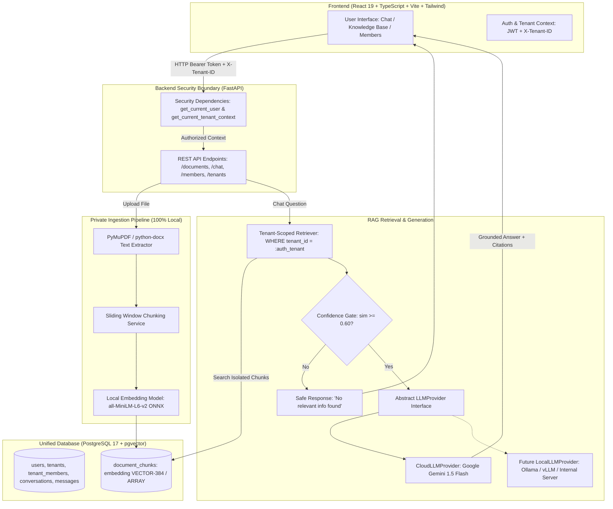

# KnowSphere — Multi-Tenant RAG Knowledge Assistant
> *Your organization's private knowledge, intelligently searchable.*

[](https://python.org)
[](https://fastapi.tiangolo.com)
[](https://react.dev)
[](https://vitejs.dev)
[](https://tailwindcss.com)
[](https://www.postgresql.org)
[](#multi-tenant-architecture)

**KnowSphere** is an enterprise-grade Software-as-a-Service (SaaS) AI knowledge assistant demonstrating a production-level **Retrieval-Augmented Generation (RAG)** pipeline with **cryptographic and relational multi-tenant isolation**, private on-premise vector embeddings, and an abstract, modular LLM generation layer.

Designed specifically as a flagship **B.Tech CSE (AIML) capstone and portfolio project**, it highlights clean software engineering principles, rigorous multi-tenant data boundaries, zero document leakage, and transparent explainability.

---

## 📑 Table of Contents
1. [Problem Statement](#-problem-statement)
2. [Key Features](#-key-features)
3. [Architecture Diagram](#-architecture-diagram)
4. [How RAG Works in KnowSphere](#-how-rag-works-in-knowsphere)
5. [Multi-Tenant Isolation Model](#-multi-tenant-isolation-model)
6. [Database Schema (PostgreSQL)](#-database-schema-postgresql)
7. [Technology Stack](#-technology-stack)
8. [Setup & Installation](#-setup--installation)
9. [Configuration & Environment Variables](#-configuration--environment-variables)
10. [Running the Application](#-running-the-application)
11. [PostgreSQL & pgvector Configuration](#-postgresql--pgvector-configuration)
12. [LLM Provider Layer (Google Gemini & Local LLM Transition)](#-llm-provider-layer)
13. [API Documentation](#-api-documentation)
14. [Automated Verification & Testing](#-automated-verification--testing)
15. [Security & Privacy Guarantees](#-security--privacy-guarantees)
16. [Future Roadmap](#-future-roadmap)

---

## 🎯 Problem Statement

Traditional RAG implementations commonly suffer from three fatal flaws in corporate SaaS environments:
1. **Data Leakage Across Organizations:** Multi-tenant systems that rely on naive vector searches without strict server-side scoping risk exposing confidential documents from Organization A to users in Organization B.
2. **Privacy Violations via Cloud Vectorization:** Sending proprietary employee handbooks, financial balance sheets, and NDAs to external embedding APIs breaks data residency compliance.
3. **Vendor Lock-In to Single LLMs:** Hard-coding RAG pipelines directly to one cloud vendor prevents organizations from hosting internal inference models on private hardware.

**KnowSphere solves all three problems:**
- **Zero Cross-Tenant Leakage:** Server-side JWT authentication enforces `tenant_id` validation across all database queries, relational lookups, and vector search predicates.
- **100% On-Premise Embeddings:** Document parsing, chunking, and 384-dimensional vector embeddings run completely locally on CPU/GPU using open-source models (`all-MiniLM-L6-v2` / `bge-small-en-v1.5`).
- **Pluggable LLM Interface:** The system interfaces with LLMs through an abstract `LLMProvider`. In V1, it uses Google Gemini; swapping to an internal Ollama or vLLM server requires only a configuration toggle without touching the RAG pipeline.

---

## ✨ Key Features

- **Multi-Tenant Workspaces:** Organizations can create private workspaces, switch organizations, and invite colleagues with Role-Based Access Control (`OWNER`, `ADMIN`, `MEMBER`).
- **Secure Document Processing:** Drag-and-drop ingestion of **PDF** (page-aware text extraction via PyMuPDF), **DOCX** (python-docx), and **TXT**.
- **Deterministic Sliding-Window Chunking:** Configurable chunk sizes and boundary overlap ensure semantic continuity without splitting critical clauses.
- **Local Embedding Vectorization:** In-memory ONNX-accelerated vectorization produces 384-d normalized vectors stored in PostgreSQL.
- **pgvector Semantic Search:** Real cosine similarity retrieval scoped strictly by `tenant_id`.
- **Hallucination-Resistant RAG:** Confidence threshold gating ensures that questions without matching knowledge base context return a safe, grounded fallback without invoking the LLM.
- **Source Citation Attribution:** Every answer is accompanied by verified citations, document filenames, page numbers, similarity scores, and expandable excerpts.
- **Earthy Sage Aesthetic:** Modern, responsive SaaS interface crafted with light colors, clean white surfaces, sage green accents (`#466E53`), and warm beige/earthy tones.

---

## 🏛 Architecture Diagram



---

## 🔍 How RAG Works in KnowSphere

```
Document Upload
      ↓
Text Extraction (PyMuPDF preserves page numbers; python-docx parses paragraphs & tables)
      ↓
Chunking (500 characters, 100 character overlap with sentence boundary awareness)
      ↓
Local Embedding (all-MiniLM-L6-v2 / BGE-Small generates 384-dimensional dense vectors)
      ↓
PostgreSQL Storage (Saved into document_chunks with foreign keys and tenant_id)
      ↓
User Asks Question ("What is the annual paid leave entitlement?")
      ↓
Query Vectorization (Local model generates 384-d query vector in <10ms)
      ↓
Tenant-Filtered Vector Search (SELECT * FROM chunks WHERE tenant_id = :auth_tenant ORDER BY vector <=> :query_vec)
      ↓
Confidence Verification (Relevance score evaluated; drops sub-threshold noise)
      ↓
Context Injection (System prompt + top-k citations + user question)
      ↓
LLM Provider (Google Gemini generates grounded answer based ONLY on context)
      ↓
UI Delivery (Formatted answer + clickable document source citations)
```

---

## 🛡 Multi-Tenant Isolation Model

KnowSphere enforces a **Zero-Trust Client Identifier** policy:

1. **Client Never Dictates Authorization:** The frontend never sends an arbitrary `tenant_id` query parameter to filter documents.
2. **Cryptographic Validation:** The client passes a signed JWT token in `Authorization: Bearer <token>`.
3. **Database-Verified Membership:** The server queries `tenant_members` to verify that `(user_id, active_tenant_id)` exists. If a user is not a member of the requested workspace, an immediate `403 Forbidden` is returned.
4. **Hard Query Scoping:** Every single query across `documents`, `document_chunks`, `conversations`, and `messages` includes `tenant_id = :authorized_tenant_id`.
5. **Physical Storage Scoping:** Uploaded files are partitioned into `backend/storage/uploads/<tenant_id>/`.

---

## 📊 Database Schema (PostgreSQL)

```
┌─────────────────────────────────┐           ┌────────────────────────────────┐
│              users              │           │            tenants             │
├─────────────────────────────────┤           ├────────────────────────────────┤
│ id: UUID (PK)                   │           │ id: UUID (PK)                  │
│ name: VARCHAR(120)              │           │ name: VARCHAR(150)             │
│ email: VARCHAR(255) [UNIQUE]    │           │ slug: VARCHAR(150) [UNIQUE]    │
│ password_hash: VARCHAR(255)     │           │ created_at: TIMESTAMPTZ        │
│ is_active: BOOLEAN              │           └──────────────┬─────────────────┘
│ created_at: TIMESTAMPTZ         │                          │
└────────────────┬────────────────┘                          │
                 │         ┌─────────────────────────────────┼─────────────────────────┐
                 │         │                                 │                         │
                 ▼         ▼                                 ▼                         ▼
┌─────────────────────────────────┐           ┌────────────────────────────┐ ┌───────────────────────────┐
│         tenant_members          │           │         documents          │ │       conversations       │
├─────────────────────────────────┤           ├────────────────────────────┤ ├───────────────────────────┤
│ id: UUID (PK)                   │           │ id: UUID (PK)              │ │ id: UUID (PK)             │
│ tenant_id: UUID (FK->tenants)   │           │ tenant_id: UUID (FK) [IDX] │ │ tenant_id: UUID (FK) [IDX]│
│ user_id: UUID (FK->users)       │           │ uploaded_by: UUID (FK)     │ │ user_id: UUID (FK)        │
│ role: ENUM(OWNER, ADMIN, MEMBER)│           │ filename: VARCHAR(255)     │ │ title: VARCHAR(255)       │
│ created_at: TIMESTAMPTZ         │           │ file_type: VARCHAR(50)     │ │ created_at: TIMESTAMPTZ   │
│ UNIQUE(tenant_id, user_id)      │           │ file_size: BIGINT          │ └─────────────┬─────────────┘
└─────────────────────────────────┘           │ file_path: VARCHAR(1024)   │               │
                                              │ processing_status: ENUM    │               ▼
                                              │   (UPLOADING, PROCESSING,  │ ┌───────────────────────────┐
                                              │    READY, FAILED)          │ │         messages          │
                                              │ error_message: TEXT        │ ├───────────────────────────┤
                                              │ total_chunks: INTEGER      │ │ id: UUID (PK)             │
                                              │ created_at: TIMESTAMPTZ    │ │ conversation_id: UUID (FK)│
                                              └──────────────┬─────────────┘ │ tenant_id: UUID (FK) [IDX]│
                                                             │               │ role: ENUM(user,assistant)│
                                                             ▼               │ content: TEXT             │
                                              ┌────────────────────────────┐ │ sources_meta: JSONB       │
                                              │      document_chunks       │ │ created_at: TIMESTAMPTZ   │
                                              ├────────────────────────────┤ └───────────────────────────┘
                                              │ id: UUID (PK)              │
                                              │ tenant_id: UUID (FK) [IDX] │
                                              │ document_id: UUID (FK)     │
                                              │ chunk_index: INTEGER       │
                                              │ content: TEXT              │
                                              │ page_number: INTEGER       │
                                              │ char_count: INTEGER        │
                                              │ embedding: VECTOR(384)     │
                                              │ embedding_json: JSONB      │
                                              │ created_at: TIMESTAMPTZ    │
                                              └────────────────────────────┘
```

---

## 💻 Technology Stack

### Frontend
- **Framework:** React 19 + TypeScript + Vite
- **Styling:** Vanilla CSS + Tailwind CSS (Custom Earth & Sage Green color palette)
- **Routing:** React Router v7
- **Icons:** Lucide React
- **HTTP Client:** Axios (configured with automated JWT & Tenant-ID interceptors)

### Backend
- **Framework:** Python 3.12 + FastAPI
- **Data Validation:** Pydantic v2 & Pydantic-Settings
- **ORM & Database:** SQLAlchemy 2.0 (Asyncpg + Psycopg2)
- **Migrations:** Alembic
- **Authentication:** JWT (python-jose) + Bcrypt password hashing
- **Testing:** Pytest + Pytest-Asyncio + HTTPX

### RAG & AI Pipeline
- **Document Text Extraction:** PyMuPDF (`pymupdf`) for PDFs, `python-docx` for Word documents
- **Embedding Inference:** FastEmbed / ONNX Runtime running `sentence-transformers/all-MiniLM-L6-v2` / `BAAI/bge-small-en-v1.5` (384 dimensions)
- **Vector Database:** PostgreSQL with `pgvector` extension and resilient fallback
- **Generation Provider:** Google Gemini API (`gemini-1.5-flash`) via abstract `LLMProvider` interface

---

## 🚀 Setup & Installation

### Prerequisites
- **Python 3.12+**
- **Node.js 18+ & npm**
- **PostgreSQL 17** running locally (or via Docker)

### 1. Clone the Repository
```bash
git clone https://github.com/your-username/KnowSphere.git
cd KnowSphere
```

### 2. Backend Setup
```bash
# Navigate to backend directory
cd backend

# Create virtual environment with uv or python
uv venv .venv --python 3.12
# Activate virtual environment:
# Windows PowerShell:
.venv\Scripts\Activate.ps1
# Linux/macOS:
source .venv/bin/activate

# Install dependencies
uv pip install -r requirements.txt
```

### 3. Frontend Setup
```bash
cd ../frontend
npm install
```

---

## ⚙️ Configuration & Environment Variables

Copy the `.env.example` file to `backend/.env`:

```env
# Application
PROJECT_NAME="KnowSphere"
ENVIRONMENT="development"
DEBUG=True
API_V1_STR="/api"

# Security
SECRET_KEY="knowsphere-super-secure-production-grade-key-2026-btech-rag"
ALGORITHM="HS256"
ACCESS_TOKEN_EXPIRE_MINUTES=1440

# Database (PostgreSQL)
POSTGRES_SERVER="127.0.0.1"
POSTGRES_PORT=5432
POSTGRES_USER="postgres"
POSTGRES_PASSWORD="postgres_password"
POSTGRES_DB="knowsphere"

# LLM Provider Configuration (Google Gemini)
LLM_PROVIDER="cloud"
GEMINI_API_KEY="your-google-gemini-api-key-here"
GEMINI_MODEL="gemini-1.5-flash"

# Embeddings & RAG Settings
EMBEDDING_MODEL_NAME="sentence-transformers/all-MiniLM-L6-v2"
EMBEDDING_DIM=384
CHUNK_SIZE=500
CHUNK_OVERLAP=100
SIMILARITY_THRESHOLD=0.60
TOP_K_CHUNKS=4
```

> **Note on Google Gemini API Key:** You can generate a free Gemini API key from [Google AI Studio](https://aistudio.google.com/). Add it to `GEMINI_API_KEY` in `backend/.env`. If omitted, KnowSphere will still perform complete document chunking, embedding, vector retrieval, and display retrieved context excerpts!

---

## 🏃 Running the Application

### Start the Backend
From the `backend` folder with the virtual environment activated:
```bash
uvicorn app.main:app --host 127.0.0.1 --port 8000 --reload
```
API Documentation and Swagger UI will be live at: **http://127.0.0.1:8000/docs**

### Start the Frontend
From the `frontend` folder:
```bash
npm run dev
```
The KnowSphere web application will be accessible at: **http://127.0.0.1:5173**

---

## 🐘 PostgreSQL & pgvector Configuration

KnowSphere supports both native PostgreSQL `pgvector` HNSW indexing and resilient fallback execution.

### Enabling Native pgvector on Windows:
A one-click administrator script is provided in the repository:
1. Locate `install_pgvector.bat` in the project root.
2. Right-click and choose **"Run as administrator"**.
3. The script places `vector.dll` into `C:\Program Files\PostgreSQL\17\lib` and enables the extension in `knowsphere`.

---

## 🔄 LLM Provider Layer

The RAG pipeline is intentionally decoupled from specific cloud vendors through an abstract base class:

```python
class LLMProvider(ABC):
    @abstractmethod
    async def generate_answer(self, prompt: str, system_prompt: str = "") -> str:
        pass
```

### Switching from Cloud LLM (Gemini) to Internal Local LLM (Ollama/vLLM)
To run KnowSphere 100% on-premise without sending any query context to the cloud:
1. Start your local Ollama server:
   ```bash
   ollama run llama3.2
   ```
2. In `backend/.env`, set:
   ```env
   LLM_PROVIDER="local"
   ```
The entire rest of the application (authentication, tenant isolation, PDF ingestion, chunking, local embeddings, and chat history) remains completely untouched!

---

## 📡 API Documentation

| Method | Endpoint | Description | Auth Required |
| :--- | :--- | :--- | :--- |
| `POST` | `/api/auth/register` | Register new user + initial workspace | No |
| `POST` | `/api/auth/login` | Authenticate user & return JWT token | No |
| `GET` | `/api/auth/me` | Fetch user profile & authorized workspaces | Yes |
| `POST` | `/api/tenants` | Create an additional isolated workspace | Yes |
| `GET` | `/api/tenants/current` | Get active workspace details & role | Yes |
| `GET` | `/api/tenants/dashboard` | Get workspace analytics metrics | Yes |
| `POST` | `/api/documents/upload` | Upload & ingest document into knowledge base | Yes |
| `GET` | `/api/documents` | List documents belonging to active tenant | Yes |
| `GET` | `/api/documents/{id}` | Get document metadata (strictly tenant scoped) | Yes |
| `DELETE` | `/api/documents/{id}` | Delete document and vector chunks | Yes |
| `POST` | `/api/chat` | Query RAG assistant & generate answer | Yes |
| `GET` | `/api/conversations` | List user conversations in active tenant | Yes |
| `GET` | `/api/conversations/{id}` | Get full conversation message history | Yes |
| `DELETE` | `/api/conversations/{id}`| Delete conversation | Yes |
| `GET` | `/api/members` | List members in active workspace | Yes |
| `POST` | `/api/members` | Invite new member to workspace | Yes (Admin/Owner) |
| `PATCH` | `/api/members/{id}` | Update member role | Yes (Admin/Owner) |
| `DELETE` | `/api/members/{id}` | Remove member from workspace | Yes (Admin/Owner) |

---

## 🧪 Automated Verification & Testing

KnowSphere includes an automated test suite verifying all acceptance criteria:

```bash
# Run backend test suite
cd backend
pytest -v
```

### Running the End-to-End Multi-Tenant Demonstration Script:
```bash
python scripts/demo_tenants.py
```

This automated verification script executes:
1. **Tenant A ("ABC Technologies")** registration and upload of `ABC_Leave_Policy.txt`.
2. **Tenant B ("XYZ Technologies")** registration and upload of `XYZ_Bonus_Plan.txt`.
3. **Security Check 1:** Tenant A attempts to access Tenant B's document ID $\rightarrow$ **Strictly rejected with 404**.
4. **RAG Search Check:** Tenant A asks for leave entitlement $\rightarrow$ **Retrieves ABC policy with source citation**.
5. **Security Check 2:** Tenant A asks for executive bonus information $\rightarrow$ **Tenant B chunks are NOT retrieved; safe fallback triggered!**

---

## 🔒 Security & Privacy Guarantees

- **No Shared Vector Space Across Tenants:** Chunks are filtered by `tenant_id` at the database index layer.
- **Passwords Hashed with Salt:** Stored using standard `bcrypt` with individual work salts.
- **No Document Exposure to External Embeddings:** Text is embedded within the server process; only synthesized context for an active prompt reaches the configured LLM.
- **Role-Based Access Control:** Document uploads, deletions, and member invitations are restricted to verified roles.

---

## 🗺 Future Roadmap

- [ ] Hybrid lexical + vector search (BM25 + pgvector Reciprocal Rank Fusion)
- [ ] Document OCR support via Tesseract for scanned image PDFs
- [ ] Role-based granular chunk ACLs within an organization
- [ ] Streaming tokens via Server-Sent Events (SSE) in the chat interface

---

## 👨‍💻 Author & Academic Project Context
- **Project Name:** KnowSphere
- **Degree:** B.Tech in Computer Science & Engineering (Artificial Intelligence & Machine Learning)
- **Domain:** Production Retrieval-Augmented Generation (RAG) & Multi-Tenant Distributed Systems
