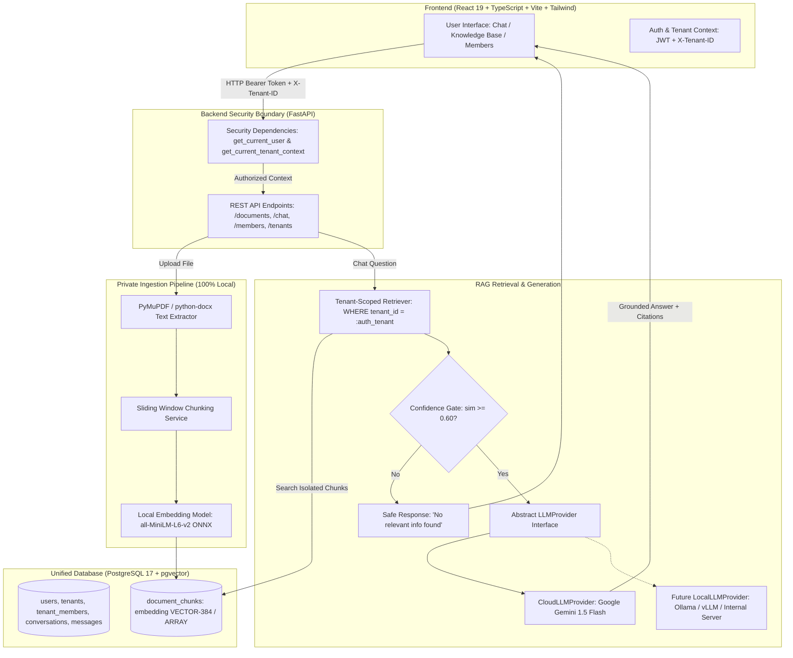

# KnowSphere — Multi-Tenant RAG Knowledge Assistant
> *Your organization's private knowledge, intelligently searchable.*

**KnowSphere** is an enterprise-grade Software-as-a-Service (SaaS) AI knowledge assistant demonstrating a production-level **Retrieval-Augmented Generation (RAG)** pipeline with **cryptographic and relational multi-tenant isolation**, private on-premise vector embeddings, and an abstract, modular LLM generation layer.

Designed specifically as a flagship **B.Tech CSE (AIML) capstone and portfolio project**, it highlights clean software engineering principles, rigorous multi-tenant data boundaries, zero document leakage, and transparent explainability.

---

## 📑 Table of Contents
1. [Problem Statement](#-problem-statement)
2. [Key Features](#-key-features)
3. [Architecture Diagram](#-architecture-diagram)
4. [How RAG Works in KnowSphere](#-how-rag-works-in-knowsphere)
5. [Multi-Tenant Isolation Model](#-multi-tenant-isolation-model)
6. [Database Schema (PostgreSQL)](#-database-schema-postgresql)
7. [Technology Stack](#-technology-stack)
8. [Setup & Installation](#-setup--installation)
9. [Configuration & Environment Variables](#-configuration--environment-variables)
10. [Running the Application](#-running-the-application)
11. [PostgreSQL & pgvector Configuration](#-postgresql--pgvector-configuration)
12. [LLM Provider Layer (Google Gemini & Local LLM Transition)](#-llm-provider-layer)
13. [API Documentation](#-api-documentation)
14. [Automated Verification & Testing](#-automated-verification--testing)
15. [Security & Privacy Guarantees](#-security--privacy-guarantees)
16. [Future Roadmap](#-future-roadmap)

---

## 🎯 Problem Statement

Traditional RAG implementations commonly suffer from three fatal flaws in corporate SaaS environments:
1. **Data Leakage Across Organizations:** Multi-tenant systems that rely on naive vector searches without strict server-side scoping risk exposing confidential documents from Organization A to users in Organization B.
2. **Privacy Violations via Cloud Vectorization:** Sending proprietary employee handbooks, financial balance sheets, and NDAs to external embedding APIs breaks data residency compliance.
3. **Vendor Lock-In to Single LLMs:** Hard-coding RAG pipelines directly to one cloud vendor prevents organizations from hosting internal inference models on private hardware.

**KnowSphere solves all three problems:**
- **Zero Cross-Tenant Leakage:** Server-side JWT authentication enforces `tenant_id` validation across all database queries, relational lookups, and vector search predicates.
- **100% On-Premise Embeddings:** Document parsing, chunking, and 384-dimensional vector embeddings run completely locally on CPU/GPU using open-source models (`all-MiniLM-L6-v2` / `bge-small-en-v1.5`).
- **Pluggable LLM Interface:** The system interfaces with LLMs through an abstract `LLMProvider`. In V1, it uses Google Gemini; swapping to an internal Ollama or vLLM server requires only a configuration toggle without touching the RAG pipeline.

---

## ✨ Key Features

- **Multi-Tenant Workspaces:** Organizations can create private workspaces, switch organizations, and invite colleagues with Role-Based Access Control (`OWNER`, `ADMIN`, `MEMBER`).
- **Secure Document Processing:** Drag-and-drop ingestion of **PDF** (page-aware text extraction via PyMuPDF), **DOCX** (python-docx), and **TXT**.
- **Deterministic Sliding-Window Chunking:** Configurable chunk sizes and boundary overlap ensure semantic continuity without splitting critical clauses.
- **Local Embedding Vectorization:** In-memory ONNX-accelerated vectorization produces 384-d normalized vectors stored in PostgreSQL.
- **pgvector Semantic Search:** Real cosine similarity retrieval scoped strictly by `tenant_id`.
- **Hallucination-Resistant RAG:** Confidence threshold gating ensures that questions without matching knowledge base context return a safe, grounded fallback without invoking the LLM.
- **Source Citation Attribution:** Every answer is accompanied by verified citations, document filenames, page numbers, similarity scores, and expandable excerpts.
- **Earthy Sage Aesthetic:** Modern, responsive SaaS interface crafted with light colors, clean white surfaces, sage green accents (`#466E53`), and warm beige/earthy tones.

---

## 🏛 Architecture Diagram

---

## 🔍 How RAG Works in KnowSphere

