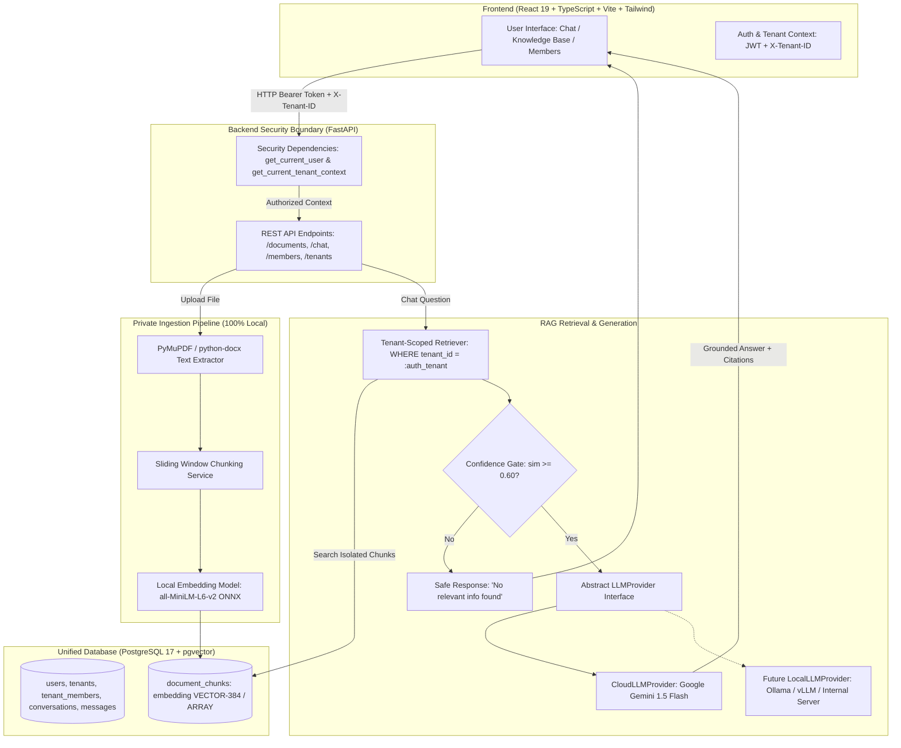

# KnowSphere — Multi-Tenant RAG Knowledge Assistant
> *Your organization's private knowledge, intelligently searchable.*

[](https://python.org)
[](https://fastapi.tiangolo.com)
[](https://react.dev)
[](https://vitejs.dev)
[](https://tailwindcss.com)
[](https://www.postgresql.org)
[](#multi-tenant-architecture)

**KnowSphere** is an enterprise-grade Software-as-a-Service (SaaS) AI knowledge assistant demonstrating a production-level **Retrieval-Augmented Generation (RAG)** pipeline with **cryptographic and relational multi-tenant isolation**, private on-premise vector embeddings, and an abstract, modular LLM generation layer.

Designed specifically as a flagship **B.Tech CSE (AIML) capstone and portfolio project**, it highlights clean software engineering principles, rigorous multi-tenant data boundaries, zero document leakage, and transparent explainability.

---

## 📑 Table of Contents
1. [Problem Statement](#-problem-statement)
2. [Key Features](#-key-features)
3. [Architecture Diagram](#-architecture-diagram)
4. [How RAG Works in KnowSphere](#-how-rag-works-in-knowsphere)
5. [Multi-Tenant Isolation Model](#-multi-tenant-isolation-model)
6. [Database Schema (PostgreSQL)](#-database-schema-postgresql)
7. [Technology Stack](#-technology-stack)
8. [Setup & Installation](#-setup--installation)
9. [Configuration & Environment Variables](#-configuration--environment-variables)
10. [Running the Application](#-running-the-application)
11. [PostgreSQL & pgvector Configuration](#-postgresql--pgvector-configuration)
12. [LLM Provider Layer (Google Gemini & Local LLM Transition)](#-llm-provider-layer)
13. [API Documentation](#-api-documentation)
14. [Automated Verification & Testing](#-automated-verification--testing)
15. [Security & Privacy Guarantees](#-security--privacy-guarantees)
16. [Future Roadmap](#-future-roadmap)

---

## 🎯 Problem Statement

Traditional RAG implementations commonly suffer from three fatal flaws in corporate SaaS environments:
1. **Data Leakage Across Organizations:** Multi-tenant systems that rely on naive vector searches without strict server-side scoping risk exposing confidential documents from Organization A to users in Organization B.
2. **Privacy Violations via Cloud Vectorization:** Sending proprietary employee handbooks, financial balance sheets, and NDAs to external embedding APIs breaks data residency compliance.
3. **Vendor Lock-In to Single LLMs:** Hard-coding RAG pipelines directly to one cloud vendor prevents organizations from hosting internal inference models on private hardware.

**KnowSphere solves all three problems:**
- **Zero Cross-Tenant Leakage:** Server-side JWT authentication enforces `tenant_id` validation across all database queries, relational lookups, and vector search predicates.
- **100% On-Premise Embeddings:** Document parsing, chunking, and 384-dimensional vector embeddings run completely locally on CPU/GPU using open-source models (`all-MiniLM-L6-v2` / `bge-small-en-v1.5`).
- **Pluggable LLM Interface:** The system interfaces with LLMs through an abstract `LLMProvider`. In V1, it uses Google Gemini; swapping to an internal Ollama or vLLM server requires only a configuration toggle without touching the RAG pipeline.

---

## ✨ Key Features

- **Multi-Tenant Workspaces:** Organizations can create private workspaces, switch organizations, and invite colleagues with Role-Based Access Control (`OWNER`, `ADMIN`, `MEMBER`).
- **Secure Document Processing:** Drag-and-drop ingestion of **PDF** (page-aware text extraction via PyMuPDF), **DOCX** (python-docx), and **TXT**.
- **Deterministic Sliding-Window Chunking:** Configurable chunk sizes and boundary overlap ensure semantic continuity without splitting critical clauses.
- **Local Embedding Vectorization:** In-memory ONNX-accelerated vectorization produces 384-d normalized vectors stored in PostgreSQL.
- **pgvector Semantic Search:** Real cosine similarity retrieval scoped strictly by `tenant_id`.
- **Hallucination-Resistant RAG:** Confidence threshold gating ensures that questions without matching knowledge base context return a safe, grounded fallback without invoking the LLM.
- **Source Citation Attribution:** Every answer is accompanied by verified citations, document filenames, page numbers, similarity scores, and expandable excerpts.
- **Earthy Sage Aesthetic:** Modern, responsive SaaS interface crafted with light colors, clean white surfaces, sage green accents (`#466E53`), and warm beige/earthy tones.

---

## 🏛 Architecture Diagram



---

## 🔍 How RAG Works in KnowSphere

```
Document Upload
      ↓
Text Extraction (PyMuPDF preserves page numbers; python-docx parses paragraphs & tables)
      ↓
Chunking (500 characters, 100 character overlap with sentence boundary awareness)
      ↓
Local Embedding (all-MiniLM-L6-v2 / BGE-Small generates 384-dimensional dense vectors)
      ↓
PostgreSQL Storage (Saved into document_chunks with foreign keys and tenant_id)
      ↓
User Asks Question ("What is the annual paid leave entitlement?")
      ↓
Query Vectorization (Local model generates 384-d query vector in <10ms)
      ↓
Tenant-Filtered Vector Search (SELECT * FROM chunks WHERE tenant_id = :auth_tenant ORDER BY vector <=> :query_vec)
      ↓
Confidence Verification (Relevance score evaluated; drops sub-threshold noise)
      ↓
Context Injection (System prompt + top-k citations + user question)
      ↓
LLM Provider (Google Gemini generates grounded answer based ONLY on context)
      ↓
UI Delivery (Formatted answer + clickable document source citations)
```

---

## 🛡 Multi-Tenant Isolation Model

KnowSphere enforces a **Zero-Trust Client Identifier** policy:

1. **Client Never Dictates Authorization:** The frontend never sends an arbitrary `tenant_id` query parameter to filter documents.
2. **Cryptographic Validation:** The client passes a signed JWT token in `Authorization: Bearer <token>`.
3. **Database-Verified Membership:** The server queries `tenant_members` to verify that `(user_id, active_tenant_id)` exists. If a user is not a member of the requested workspace, an immediate `403 Forbidden` is returned.
4. **Hard Query Scoping:** Every single query across `documents`, `document_chunks`, `conversations`, and `messages` includes `tenant_id = :authorized_tenant_id`.
5. **Physical Storage Scoping:** Uploaded files are partitioned into `backend/storage/uploads/<tenant_id>/`.

---

## 📊 Database Schema (PostgreSQL)

```
┌─────────────────────────────────┐           ┌────────────────────────────────┐
│              users              │           │            tenants             │
├─────────────────────────────────┤           ├────────────────────────────────┤
│ id: UUID (PK)                   │           │ id: UUID (PK)                  │
│ name: VARCHAR(120)              │           │ name: VARCHAR(150)             │
│ email: VARCHAR(255) [UNIQUE]    │           │ slug: VARCHAR(150) [UNIQUE]    │
│ password_hash: VARCHAR(255)     │           │ created_at: TIMESTAMPTZ        │
│ is_active: BOOLEAN              │           └──────────────┬─────────────────┘
│ created_at: TIMESTAMPTZ         │                          │
└────────────────┬────────────────┘                          │
                 │         ┌─────────────────────────────────┼─────────────────────────┐
                 │         │                                 │                         │
                 ▼         ▼                                 ▼                         ▼
┌─────────────────────────────────┐           ┌────────────────────────────┐ ┌───────────────────────────┐
│         tenant_members          │           │         documents          │ │       conversations       │
├─────────────────────────────────┤           ├────────────────────────────┤ ├───────────────────────────┤
│ id: UUID (PK)                   │           │ id: UUID (PK)              │ │ id: UUID (PK)             │
│ tenant_id: UUID (FK->tenants)   │           │ tenant_id: UUID (FK) [IDX] │ │ tenant_id: UUID (FK) [IDX]│
│ user_id: UUID (FK->users)       │           │ uploaded_by: UUID (FK)     │ │ user_id: UUID (FK)        │
│ role: ENUM(OWNER, ADMIN, MEMBER)│           │ filename: VARCHAR(255)     │ │ title: VARCHAR(255)       │
│ created_at: TIMESTAMPTZ         │           │ file_type: VARCHAR(50)     │ │ created_at: TIMESTAMPTZ   │
│ UNIQUE(tenant_id, user_id)      │           │ file_size: BIGINT          │ └─────────────┬─────────────┘
└─────────────────────────────────┘           │ file_path: VARCHAR(1024)   │               │
                                              │ processing_status: ENUM    │               ▼
                                              │   (UPLOADING, PROCESSING,  │ ┌───────────────────────────┐
                                              │    READY, FAILED)          │ │         messages          │
                                              │ error_message: TEXT        │ ├───────────────────────────┤
                                              │ total_chunks: INTEGER      │ │ id: UUID (PK)             │
                                              │ created_at: TIMESTAMPTZ    │ │ conversation_id: UUID (FK)│
                                              └──────────────┬─────────────┘ │ tenant_id: UUID (FK) [IDX]│
                                                             │               │ role: ENUM(user,assistant)│
                                                             ▼               │ content: TEXT             │
                                              ┌────────────────────────────┐ │ sources_meta: JSONB       │
                                              │      document_chunks       │ │ created_at: TIMESTAMPTZ   │
                                              ├────────────────────────────┤ └───────────────────────────┘
                                              │ id: UUID (PK)              │
                                              │ tenant_id: UUID (FK) [IDX] │
                                              │ document_id: UUID (FK)     │
                                              │ chunk_index: INTEGER       │
                                              │ content: TEXT              │
                                              │ page_number: INTEGER       │
                                              │ char_count: INTEGER        │
                                              │ embedding: VECTOR(384)     │
                                              │ embedding_json: JSONB      │
                                              │ created_at: TIMESTAMPTZ    │
                                              └────────────────────────────┘
```

---

## 💻 Technology Stack

### Frontend
- **Framework:** React 19 + TypeScript + Vite
- **Styling:** Vanilla CSS + Tailwind CSS (Custom Earth & Sage Green color palette)
- **Routing:** React Router v7
- **Icons:** Lucide React
- **HTTP Client:** Axios (configured with automated JWT & Tenant-ID interceptors)

### Backend
- **Framework:** Python 3.12 + FastAPI
- **Data Validation:** Pydantic v2 & Pydantic-Settings
- **ORM & Database:** SQLAlchemy 2.0 (Asyncpg + Psycopg2)
- **Migrations:** Alembic
- **Authentication:** JWT (python-jose) + Bcrypt password hashing
- **Testing:** Pytest + Pytest-Asyncio + HTTPX

### RAG & AI Pipeline
- **Document Text Extraction:** PyMuPDF (`pymupdf`) for PDFs, `python-docx` for Word documents
- **Embedding Inference:** FastEmbed / ONNX Runtime running `sentence-transformers/all-MiniLM-L6-v2` / `BAAI/bge-small-en-v1.5` (384 dimensions)
- **Vector Database:** PostgreSQL with `pgvector` extension and resilient fallback
- **Generation Provider:** Google Gemini API (`gemini-1.5-flash`) via abstract `LLMProvider` interface

---

## 🚀 Setup & Installation

### Prerequisites
- **Python 3.12+**
- **Node.js 18+ & npm**
- **PostgreSQL 17** running locally (or via Docker)

### 1. Clone the Repository
```bash
git clone https://github.com/your-username/KnowSphere.git
cd KnowSphere
```

### 2. Backend Setup
```bash
# Navigate to backend directory
cd backend

# Create virtual environment with uv or python
uv venv .venv --python 3.12
# Activate virtual environment:
# Windows PowerShell:
